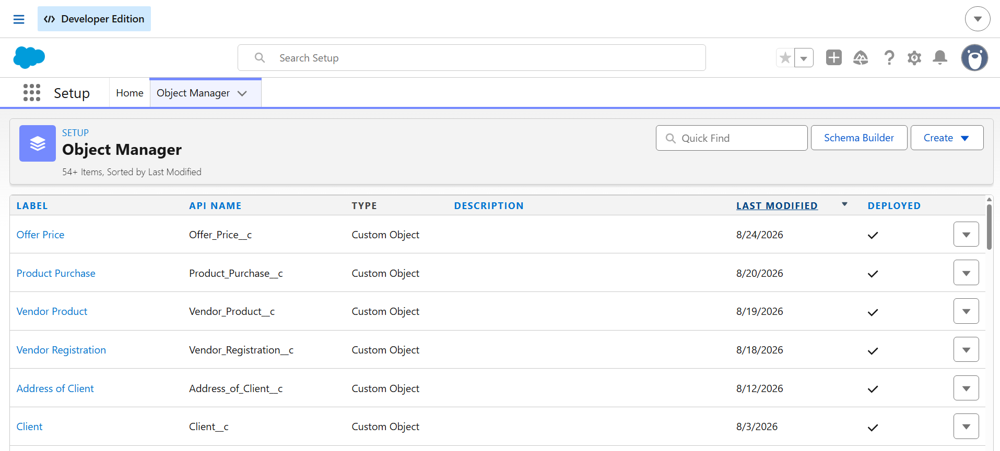
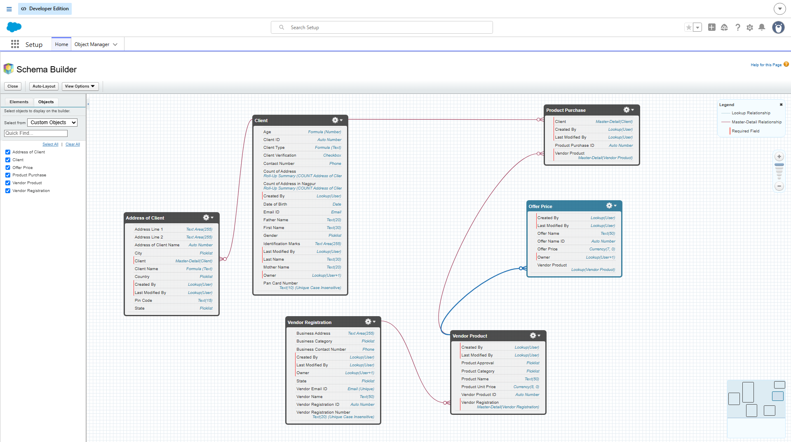
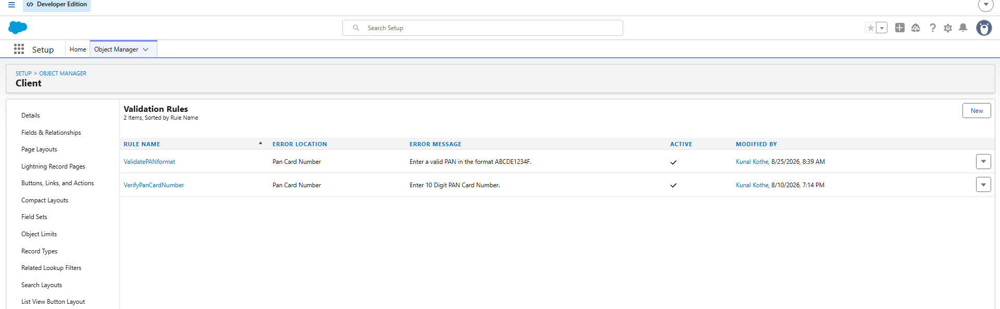
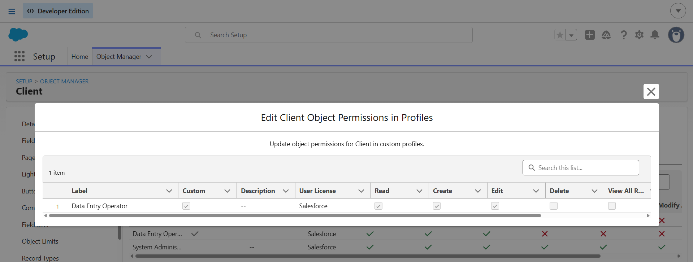

# Salesforce E-Commerce Management System

## Overview

A Salesforce-based e-commerce management system developed as a
Salesforce Administration and declarative automation project.

The system is designed to manage clients, addresses, vendors,
products, purchases, and product offers within Salesforce.

## Project Status

In Progress

## Objectives

- Manage client and address information
- Manage vendor registrations and products
- Track product purchases
- Manage product offers and pricing
- Apply Salesforce security and automation

## Salesforce Objects

- Client
- Address of Client
- Vendor Registration
- Vendor Product
- Product Purchase
- Offer Price

## Key Salesforce Features

### Data Modelling
- Custom Objects and Fields
- Lookup Relationships
- Master-Detail Relationships
- Field Dependencies
- Roll-Up Summary Fields

### Data Validation
- Validation Rules
- Formula Fields
- Data consistency controls

### Security
- Profiles
- Permission Sets
- Organization-Wide Defaults
- Role Hierarchy
- Public Groups
- Sharing Rules

### Automation
- Screen Flows
- Email Actions
- Flow-based business automation

## Project Workflow

Client information is managed through the Client object.
Client addresses are associated with clients.

Vendors are registered through Vendor Registration and their
products are managed through Vendor Product.

Product purchases connect clients with vendor products, while
Offer Price manages pricing offers for products.

## Screenshots

### Salesforce E-Commerce Application

### Data Model

### Object Configuration

### Validation

### Roll-Up Fields

### Permission Set

### Profile

### Flow Automation

## Current Scope

The current implementation focuses on Salesforce Administration
and declarative automation.

Salesforce Developer-side features are planned as future
enhancements.

## Future Enhancements

- Advanced Salesforce automation
- Apex-based business logic
- Lightning Web Components
- Additional integrations
